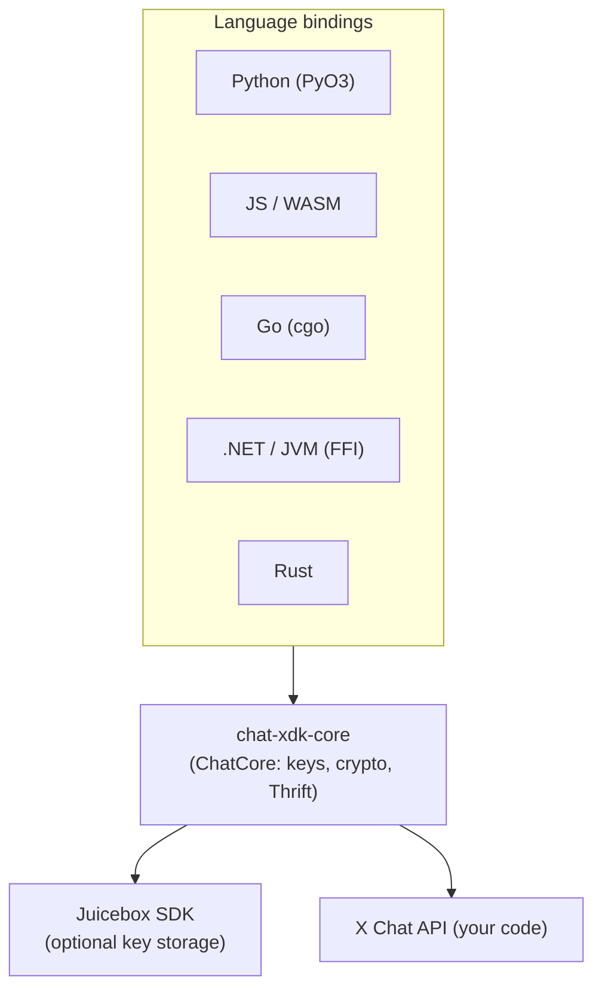

# chat-xdk

Encryption SDK for **X Chat** (encrypted Direct Messages). A single Rust core
(`chat-xdk-core`) handles key management, message encryption, signing, and the
Thrift wire protocol, exposed through idiomatic bindings for six languages.

## Bindings

| Language | Import | Backed by | Guide |
|----------|--------|-----------|-------|
| Rust | `chat-xdk-core` | — | [docs/API.md](docs/API.md) |
| Python | `chat_xdk` | PyO3 | [crates/pyo3/README.md](crates/pyo3/README.md) |
| JavaScript / WASM | `@xdevplatform/chat-xdk` | wasm-bindgen | [crates/wasm/js/README.md](crates/wasm/js/README.md) |
| Go | `github.com/xdevplatform/chat-xdk/go/chatxdk` | cgo | [crates/go/README.md](crates/go/README.md) |
| .NET | `ChatXdk` | P/Invoke | [crates/dotnet/README.md](crates/dotnet/README.md) |
| JVM | `com.x.chatxdk` | JNA | [crates/jvm/README.md](crates/jvm/README.md) |

## Examples

The fastest way in: [`examples/`](examples) has **one small, clone-and-run
encrypted chat bot per binding**. Each imports the real binding, talks to the
X Chat API, and shows the full flow (key load → decrypt → reply → encrypt →
send). Start there:

```bash
cd examples && make test-all      # offline crypto tests for every binding (no creds)
```

See [`examples/README.md`](examples/README.md) for setup, getting an access
token, and running a bot live.

## The core flow

Every binding follows the same shape (names are camelCase in JS, snake_case in
Python/Rust, PascalCase in .NET/Go):

1. **Load keys** — import a private-key blob, or recover from Juicebox (below).
2. **Set identity** — `setIdentity(userId, signingKeyVersion)` once per
   instance; every signed action defaults its sender and signing-key version
   to these values. Optionally `setCacheKeys(true)` and
   `setSigningKeys(signingKeys)` so the decrypt/encrypt calls below need no
   per-call key plumbing.
3. **Initial load** — `decryptEvents(events)`: batch-decrypts a backlog,
   extracting conversation keys from `KeyChange` events and matching signing
   keys by user automatically. Never throws; per-event errors are collected in
   the result. The events endpoint returns the `KeyChange` events in
   `meta.conversation_key_events`, separate from `data` — pass both together.
4. **Each new event** — `decryptEvent(event)`: decrypts one event
   (webhook / poll). Throws on failure.
5. **Reply** — `encryptMessage({conversationId, text})` or
   `encryptReply({conversationId, text, replyToEvent})` → POST the result to
   the X Chat API.

| Method | Use case |
|--------|----------|
| `decryptEvents` | Batch (initial load, pagination). Self-extracts keys; collects errors. |
| `decryptEvent` | Single event (webhook, real-time) with cached keys. Throws on error. |

> The conversation id is part of the message signature. The SDK signs it in its
> canonical (colon-separated) form, so you can pass either the colon or the
> hyphen form used in REST URL paths. Every derived value (sender, signing-key
> version, conversation key) still takes an explicit per-call override.

### Quick start (Python)

```python
from chat_xdk import Chat

chat = Chat()
chat.import_keys(private_key_blob, version=key_version)  # or Chat(config).unlock(pin)
chat.set_identity(my_user_id, key_version)
chat.set_cache_keys(True)
chat.set_signing_keys(signing_keys)

result = chat.decrypt_events(raw_events)
for dm in result["messages"]:
    if dm["event"]["type"] == "Message":
        print(dm["event"]["sender_id"], dm["event"]["content"]["text"])

event = chat.decrypt_event(new_event_b64)
payload = chat.encrypt_message(conversation_id, "hello")   # POST payload to the X API
```

### Quick start (JavaScript / WASM)

```typescript
import { createChat } from "@xdevplatform/chat-xdk";

const chat = await createChat({ juiceboxConfig, getAuthToken });
await chat.unlock("2580");
chat.setIdentity(myUserId, signingKeyVersion);
chat.setCacheKeys(true);
chat.setSigningKeys(signingKeys);

const result = chat.decryptEvents(rawEvents);
for (const dm of result.messages) {
  if (dm.event.type === "message") console.log(dm.event.senderId, dm.event.content.text);
}
const event = chat.decryptEvent(newEventB64);
const payload = chat.encryptMessage({ conversationId, text: "hello" });
```

Full per-language API (params + return types) is in [docs/API.md](docs/API.md);
runnable code for all six is in [`examples/`](examples).

## Key storage

Private keys can be held two ways:

- **Local blob** — `exportKeys()` / `importKeys()` move raw private-key bytes
  yourself (native bindings: Python, Go, .NET, JVM, Rust). Simplest; the bytes
  are **unencrypted identity material** — never commit them or log them. The
  browser/WASM build does not expose raw export/import and manages keys through
  Juicebox instead.
- **Juicebox (production)** — `generate_keypairs()` creates the keys, then
  `setup(pin)` stores the generated keys in
  [Juicebox](https://juicebox.xyz/) distributed PIN-protected storage;
  `unlock(pin)` recovers them on any device, so nothing secret touches disk. The
  Juicebox config comes from the X API public-keys response. See the optional
  path in [`examples/python`](examples/python).

Registering your **public** key with the X API is a separate, one-time
provisioning step in both modes.

## Cryptography

| Purpose | Algorithm |
|---------|-----------|
| Conversation key exchange | ECIES — ECDH P-256 + AES-128-GCM |
| Message content | XSalsa20-Poly1305 (256-bit key, random 192-bit nonce) |
| Media streams | `crypto_secretstream_xchacha20poly1305` |
| Message authorship | ECDSA P-256 over the encrypted content |
| Key derivation | HKDF-SHA256 |

Private key types are zeroized on drop (`zeroize`) and redact to `[REDACTED]` in
debug output; all randomness comes from the OS CSPRNG. Details and the full
encrypt/decrypt walkthroughs are in [docs/CRYPTO.md](docs/CRYPTO.md).

## Architecture



`ChatCore` is the platform-agnostic engine; `Chat` adds the Juicebox lifecycle.
Bindings are thin FFI wrappers — the crypto lives in one place. Module structure
and data flows: [docs/ARCHITECTURE.md](docs/ARCHITECTURE.md).

## Project structure

```
chat-xdk/
├── crates/
│   ├── core/     # chat-xdk-core: ChatCore engine, crypto, keys, Thrift types
│   ├── pyo3/     # Python binding (chat_xdk)
│   ├── wasm/     # JS/WASM binding (+ js/ wrapper and tests)
│   ├── go/       # Go binding (cgo + prebuilt staticlib)
│   └── dotnet/   # .NET + JVM native cdylib (chat_xdk_dotnet)
├── examples/     # one clone-and-run bot per binding (+ Makefile, CI)
├── docs/         # API.md, ARCHITECTURE.md, CRYPTO.md
└── tests/        # cross-binding fixtures (sdk_vectors.json)
```

## Building

```bash
make build              # Rust workspace
make test               # Rust tests

make wheel-dev          # Python: maturin develop
make wasm               # WASM: wasm-pack build --target web
make test-go            # Go: build staticlib + go test
make dotnet-test        # .NET: native cdylib + xUnit
make jvm-test           # JVM: native cdylib + mvn test (JDK 17+)
```

The repo depends on the [Juicebox SDK](https://github.com/juicebox-systems/juicebox-sdk)
via a path dependency at `../juicebox-sdk` (CI checks it out automatically). For
JS/WASM with Juicebox key storage you also build juicebox-sdk's wasm crate — see
[crates/wasm/js/README.md](crates/wasm/js/README.md).

## Documentation

- **[docs/API.md](docs/API.md)** — full API reference for every binding
- **[docs/ARCHITECTURE.md](docs/ARCHITECTURE.md)** — modules and data flows
- **[docs/CRYPTO.md](docs/CRYPTO.md)** — algorithms, key lifecycle, wire formats

## License

MIT — see [`LICENSE`](LICENSE).

Third-party open-source components and their notices are listed in
[`THIRD_PARTY_NOTICES.md`](THIRD_PARTY_NOTICES.md).
