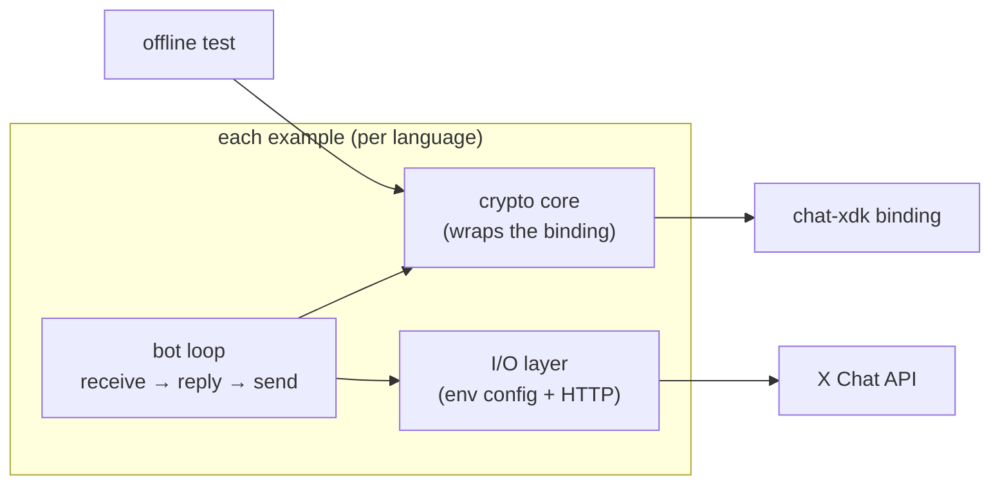

# chat-xdk examples

One small, self-contained **encrypted chat bot** per chat-xdk language binding.
Each example imports the *real* binding for its language, talks to the X Chat
API over HTTP, and showcases the messaging core:

- **Key management** — import existing private keys (or generate + register new ones)
- **Conversation keys** — prepare/decrypt the symmetric key shared by participants
- **Encryption** — turn a reply into an encrypted, signed message for the X API
- **Decryption** — both paths: batch (`decryptEvents`) on initial load and
  single-event (`decryptEvent`) for each new event

Every example is a small bot: it reads incoming DMs, decrypts them, generates a
reply (a simple echo), encrypts the reply, and sends it back.

The bots deliberately stop at that messaging core. The rest of the SDK surface
— group management (`prepareGroupCreate` / `prepareGroupMembersChange`),
reactions (`encryptAddReaction` / `encryptRemoveReaction`), and media streaming
(`encryptStream` / `streamEncryptor` / `streamDecryptor`) — is documented in
[`../docs/API.md`](../docs/API.md), with tested reference call shapes in each
binding's test suite (`crates/*/tests`, `crates/wasm/js/tests`,
`go/chatxdk/chatxdk_test.go`).

## Juicebox (optional)

The bots load keys from a local private-key blob so they stay clonable. In
production, X Chat clients keep keys in Juicebox PIN-protected storage instead;
every native binding exposes `setup`/`unlock` for it. The **Python bot** is the
reference implementation of that path: set `CHAT_PIN` in its `.env` and it
fetches the Juicebox config from the X API and unlocks (or registers) the keys
via PIN — see [`python/run.py`](python/run.py) and
[`python/chat_core.py`](python/chat_core.py). The other five bots use only the
local-blob path; port the Python flow if you need PIN storage elsewhere.

| Language | Directory | Binding it imports | Toolchain |
|----------|-----------|--------------------|-----------|
| Python | [`python/`](python) | `chat_xdk` (PyO3) | Python 3.10+ |
| JavaScript / WASM | [`js/`](js) | `@xdevplatform/chat-xdk` (WASM) | Node 18+ |
| Rust | [`rust/`](rust) | `chat-xdk-core` crate | Rust stable |
| Go | [`go/`](go) | `github.com/xdevplatform/chat-xdk/go/chatxdk` (cgo) | Go 1.21+ |
| .NET | [`dotnet/`](dotnet) | `ChatXdk` (P/Invoke) | .NET 8+ |
| JVM | [`jvm/`](jvm) | `com.x.chatxdk` (JNA) | JDK 17+, Maven |

## How they are structured

Each example separates two layers so the crypto is easy to read and test:

1. **A crypto core** — a thin wrapper around the chat-xdk binding that does
   key unlock/import, conversation-key handling, message encryption, and the
   two decryption paths. This layer never touches the network, so it can be
   unit-tested directly.
2. **A thin I/O layer** — config from environment variables, local/in-memory
   conversation state, and X Chat API calls over plain HTTP.



The offline test exercises the crypto core directly; only the I/O layer touches
the network.

## Running an example

```bash
cd examples/<language>
cp .env.example .env   # set X_ACCESS_TOKEN + CHAT_CONVERSATION_ID
# follow the per-language README to build and run
```

## Getting an access token

`X_ACCESS_TOKEN` must be an **OAuth2 user-context access token** for your bot
account, with the `dm.read` and `dm.write` scopes. The easiest way to mint one
is [`xurl`](https://github.com/xdevplatform/xurl), the X API CLI (its OAuth2
flow already requests the DM scopes):

```bash
# 1. Install (macOS)
brew install --cask xdevplatform/tap/xurl

# 2. Register your app's credentials (from the X Developer Portal)
xurl auth apps add my-bot --client-id YOUR_CLIENT_ID --client-secret YOUR_CLIENT_SECRET

# 3. Run the OAuth2 user-context flow (opens a browser, asks for DM scopes)
xurl auth oauth2 --app my-bot

# 4. Verify it works
xurl /2/users/me
```

`xurl` stores the token in `~/.xurl`; copy the `access_token` value into your
`.env` as `X_ACCESS_TOKEN`. Set `CHAT_CONVERSATION_ID` to the conversation the
bot should watch (the other user's ID for a 1:1, or a `g…` group ID).

## Testing

Each example ships **two** test paths:

- **Offline test (committed, runs in CI, no credentials):** drives the binding
  through a real `encrypt → decrypt` round-trip plus the deterministic
  key/signature vectors in
  [`../tests/fixtures/sdk_vectors.json`](../tests/fixtures/sdk_vectors.json),
  with **no mocking of the SDK**. Run `make test-all` (see [`Makefile`](Makefile)).
- **Live e2e (opt-in):** a gated test/harness that runs the messaging surface
  against the real X Chat API. It is skipped unless `CHATXDK_E2E=1` and the
  credential env vars are set, so it never runs in CI. Every language's script
  runs the same flow:
  1. batch-decrypt inbound history (paginating when a second page exists)
  2. rotate the conversation key (`prepareConversationKeyChange` →
     `POST …/keys`), then decrypt + verify its own KeyChange event back
  3. send a threaded reply with a mention entity and a 24h TTL under the
     rotated key, fetch it back, decrypt it via the single-event path, and
     assert it verifies — closing the sign → verify loop end to end
  4. add a reaction to the sent message, decrypt + verify it, then remove it

  Three optional extras: `CHATXDK_E2E_MEDIA=1` additionally stream-encrypts
  a media blob, uploads it (initialize → append → finalize), sends a message
  referencing its `media_hash_key`, then downloads and stream-decrypts it
  back to the original bytes; `CHATXDK_E2E_GROUPS=1` additionally creates a
  group (the two-signature create), sends a group message, and adds the 1:1
  partner as a member (a key rotation); `CHAT_PIN=…` (Python only)
  additionally unlocks keys via live Juicebox and checks they match the
  blob-loaded ones. Live sends carry a `chat-xdk e2e [<lang>] <timestamp>`
  marker and the TTL keeps the test conversation from accumulating history.

## Encrypted media

Media never travels in the message: the message carries a `media` attachment
descriptor referencing a `media_hash_key`, and the bytes themselves are
stream-encrypted with the conversation key and stored via the chat media
endpoints. Every example's crypto core shows the pattern with the SDK's
**incremental** stream API (`streamEncryptor` / `streamDecryptor`), feeding
fixed-size chunks through `push` and sealing with `finish` — memory stays
bounded regardless of file size, which matters most in the WASM binding where
the heap cannot hold large files whole:

- **encrypt + upload**: `encryptMedia`/`encrypt_media` (chunked `push` +
  `finish`) → `uploadMedia`/`upload_media` (initialize → 3 MB appends →
  finalize, returning the `media_hash_key`) → send a message whose
  attachment descriptor references that key
- **download + decrypt**: `downloadMedia`/`download_media` (raw **bytes** —
  never decode the body as text; that corrupts the ciphertext) →
  `decryptMedia`/`decrypt_media` (chunked `push`, then `finish`, which
  errors if the stream was truncated)

## What these examples are not

To stay clonable and simple, the examples deliberately leave out the production
plumbing the internal X services use: no Kubernetes, no message-queue fan-out,
no internal storage service, no secret-management mounts, no service-to-service
mTLS. Key storage uses a local private-key blob (or a freshly generated +
registered key) instead of the PIN-recovery key-storage network. Swap those
pieces in as needed for a real deployment.

## License

MIT
